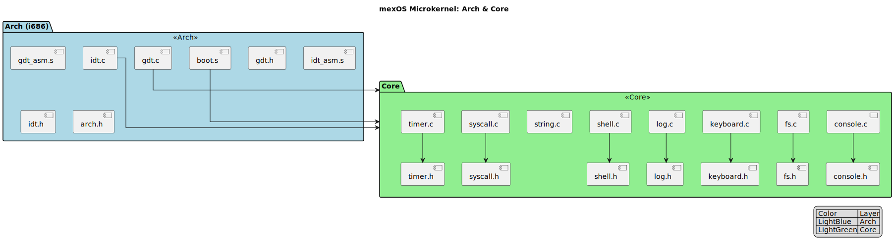
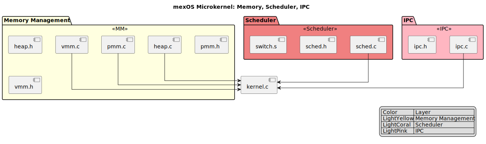
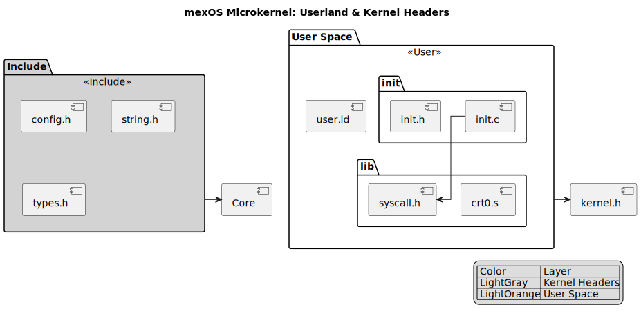
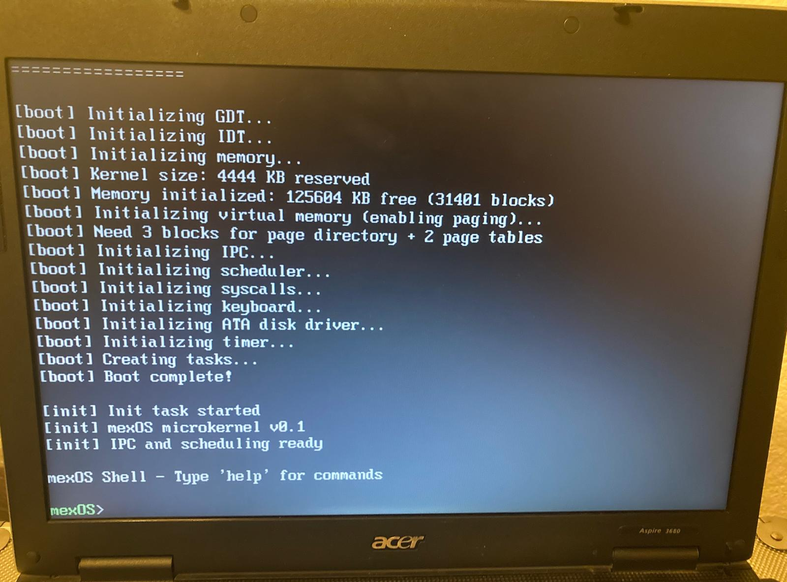
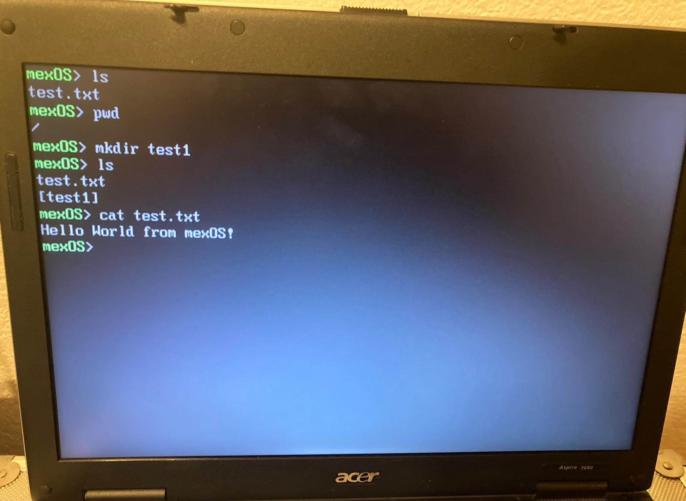
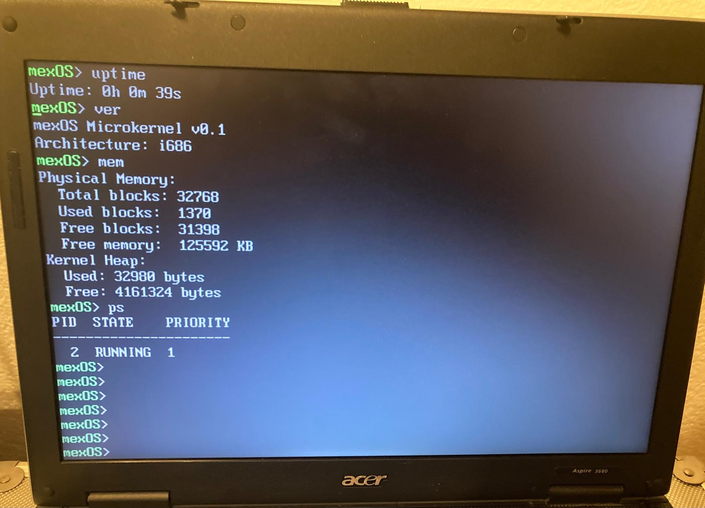
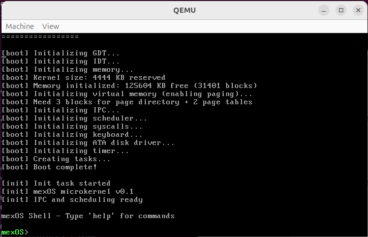
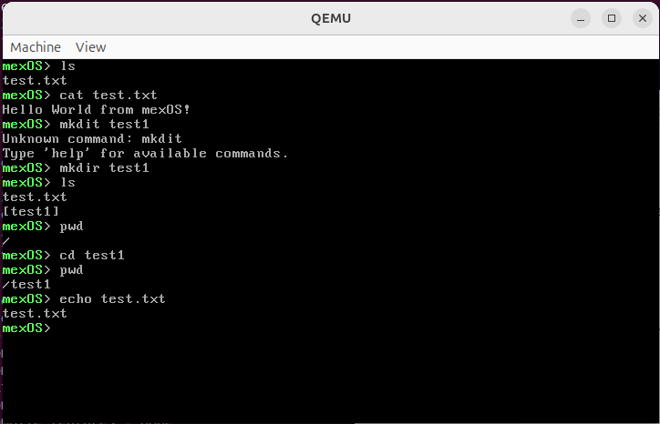
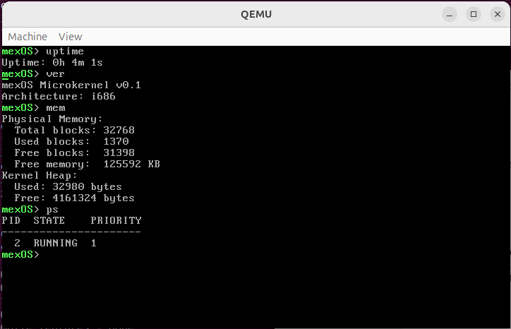
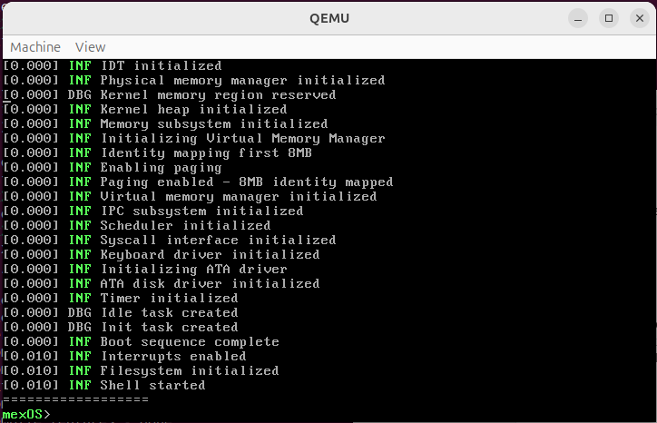

# mexOS Microkernel

A 32-bit microkernel written in C and assembly for x86 (i686) architecture.

## Architecture

### Arch & Core


### Memory, Scheduler & IPC


### User & Include



### Pictures on real hardware (iso on USB)

#### Boot log


#### ls, mkdir,, cat, edit commands


#### uptime, version, memory, ps commands


#### syslog command


### Pictures on QEMU (running as ISO and ELF)

#### Boot log


#### ls, mkdir,, cat, edit commands


#### uptime, version, memory, ps commands


#### syslog command


## Features

- Minimal kernel: only scheduling, IPC, and memory management in kernel space
- Message-based IPC for user-space servers
- Preemptive round-robin scheduler with priorities
- Physical memory manager (bitmap allocator)
- Kernel heap allocator
- System calls via INT 0x80

## Building

### Quick Start

The easiest way to build and run mexOS is using the cross-platform `run.sh` script:

```sh
# Install dependencies and build+run
./run.sh --install-deps

# Build only (without running QEMU)
./run.sh --build-only

# Build and run in QEMU
./run.sh
```

### Requirements

**Linux:**
- GCC with 32-bit support (`gcc-multilib`, `g++-multilib`)
- CMake
- QEMU (optional, for running)

**macOS:**
- Cross-compiler (`brew install x86_64-elf-gcc`)
- CMake
- QEMU (optional, for running)

### Manual Build

```sh
mkdir build && cd build
# Linux
cmake -DCMAKE_TOOLCHAIN_FILE=../toolchain.cmake ..
# macOS
cmake -DCMAKE_TOOLCHAIN_FILE=../toolchain-macos.cmake ..
make
```

## Running

```sh
qemu-system-i386 -kernel build/mexOS.elf -serial stdio -m 32M
```

## System Calls
# mexOS Syscall Table

| Number | Name             | Description                         |
|--------|------------------|-------------------------------------|
| 0      | SYS_EXIT         | Terminate the current process        |
| 1      | SYS_WRITE        | Write to console or file descriptor |
| 2      | SYS_READ         | Read from file descriptor            |
| 3      | SYS_YIELD        | Yield the CPU to the scheduler      |
| 4      | SYS_GETPID       | Get current process ID              |
| 5      | SYS_FORK         | Duplicate current process           |
| 6      | SYS_WAIT         | Wait for child process              |
| 7      | SYS_EXEC         | Execute a new program               |
| 8      | SYS_OPEN         | Open a file                         |
| 9      | SYS_CLOSE        | Close a file descriptor             |
| 10     | SYS_SEND         | Send IPC message                    |
| 11     | SYS_RECV         | Receive IPC message                 |
| 12     | SYS_PORT_CREATE  | Create an IPC port                  |
| 13     | SYS_PORT_DESTROY | Destroy an IPC port                 |
| 14     | SYS_IOCTL        | Device I/O control                  |
| 15     | SYS_MMAP         | Memory map a region                 |
| 16     | SYS_GETTIME      | Get system time                     |
| 17     | SYS_SETTIME      | Set system time                     |


## License

See LICENSE file.
