# mexOS Microkernel

A 32-bit microkernel written in C and assembly for x86 (i686) architecture.
The current state is still monolithic, but the design aims for a microkernel architecture with user-space servers handling most services.

## Architecture

### Arch & Core
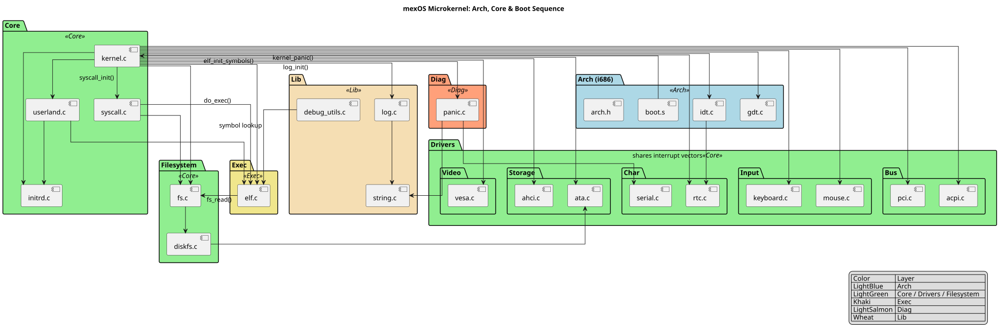

### Memory, Scheduler & IPC
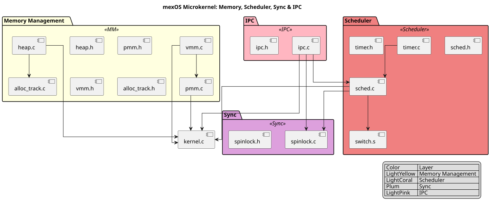

### User & Include
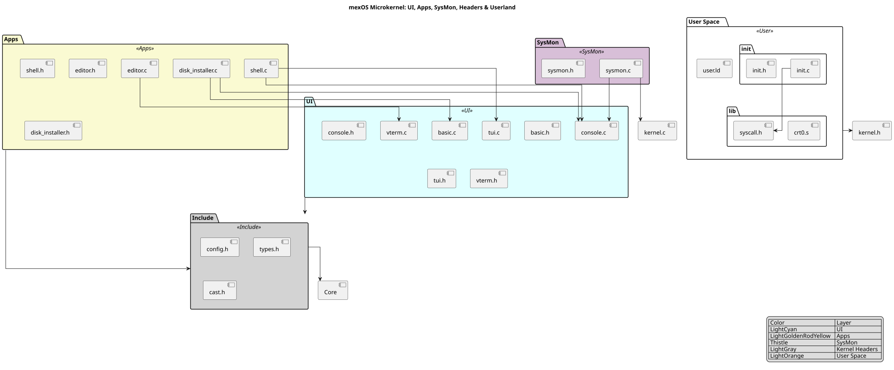


### Pictures on real hardware (iso on USB)

#### Boot log
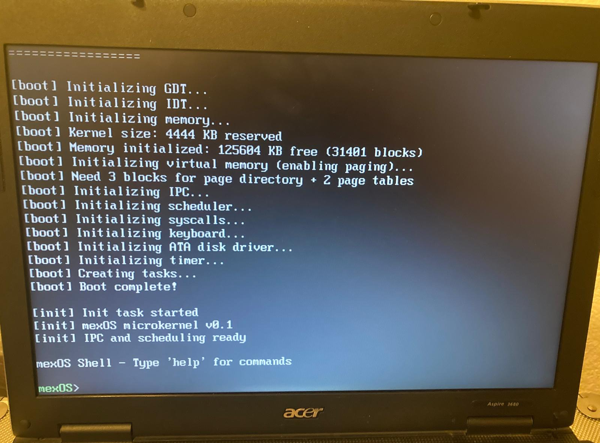

#### ls, mkdir,, cat, edit commands
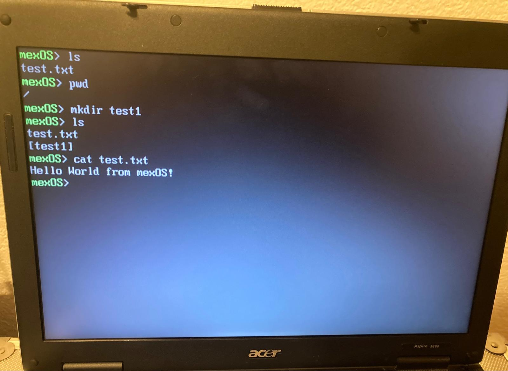

#### uptime, version, memory, ps commands
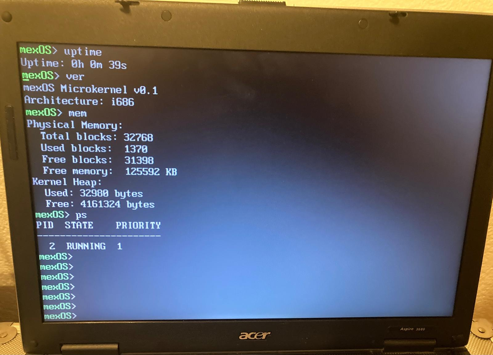

#### syslog command
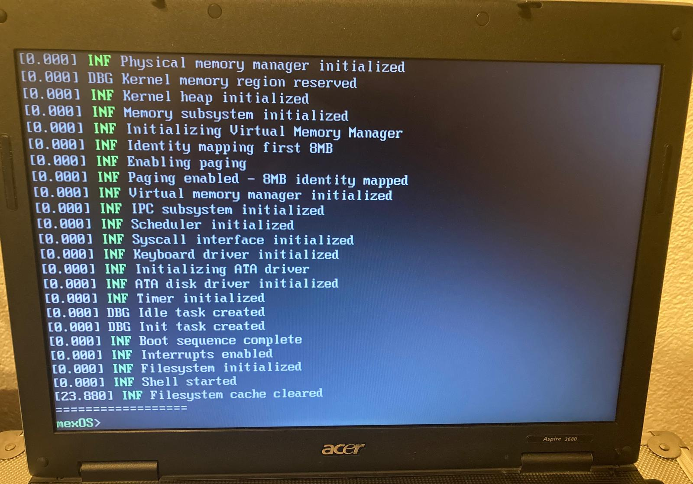

### Pictures on QEMU (running as ISO and ELF)

#### Boot log
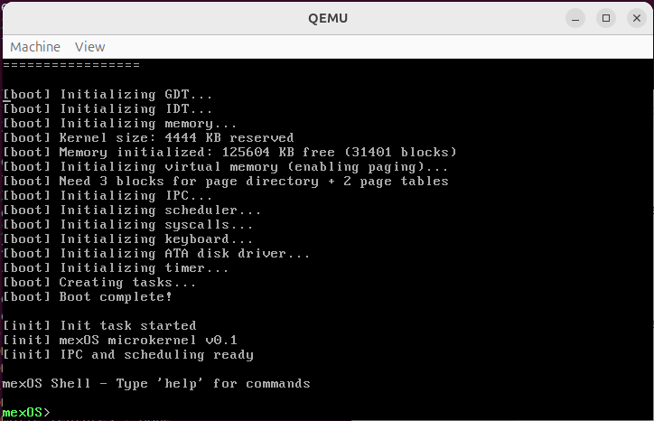

#### ls, mkdir,, cat, edit commands
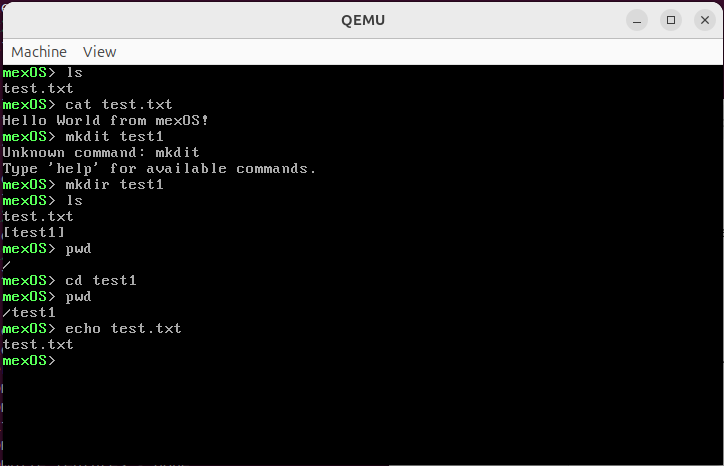

#### uptime, version, memory, ps commands
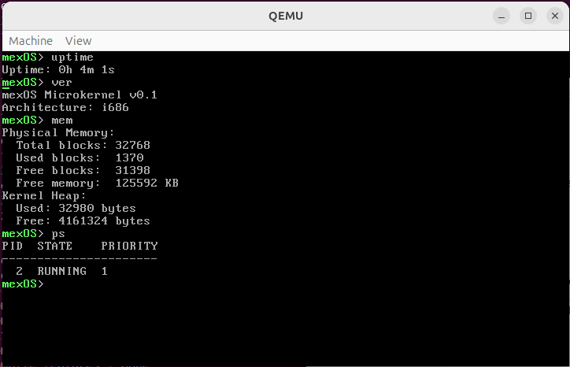

#### syslog command
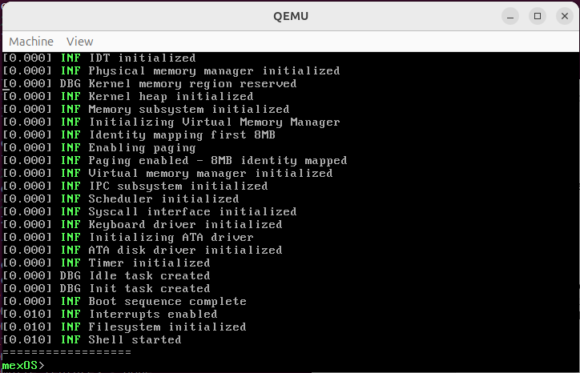

### Pictures in qemu (user-land)

## Features

- Minimal kernel: only scheduling, IPC, and memory management in kernel space
- Message-based IPC for user-space servers
- Preemptive round-robin scheduler with priorities
- Physical memory manager (bitmap allocator)
- Kernel heap allocator
- System calls via INT 0x80

## Building

### Quick Start

The easiest way to build and run mexOS is using the cross-platform `run.sh` script:

```sh
# Install dependencies and build+run
./run.sh --install-deps

# Build only (without running QEMU)
./run.sh --build-only

# Build and run in QEMU
./run.sh --run-only --run-mode iso
```

### Requirements

**Linux:**
- GCC with 32-bit support (`gcc-multilib`, `g++-multilib`)
- CMake
- QEMU (optional, for running)

**macOS:**
- Cross-compiler (`brew install x86_64-elf-gcc`)
- CMake
- QEMU (optional, for running)

### Manual Build

```sh
mkdir build && cd build
# Linux
cmake -DCMAKE_TOOLCHAIN_FILE=../toolchain.cmake ..
# macOS
cmake -DCMAKE_TOOLCHAIN_FILE=../toolchain-macos.cmake ..
make
```

## Running

```sh
qemu-system-i386 -kernel build/mexOS.elf -serial stdio -m 32M
```

## System Calls
# mexOS Syscall Table

| Number | Name             |
|--------|------------------|
| 0      | SYS_EXIT         |
| 1      | SYS_WRITE        |
| 2      | SYS_READ         |
| 3      | SYS_YIELD        |
| 4      | SYS_GETPID       |
| 5      | SYS_FORK         |
| 6      | SYS_WAIT         |
| 7      | SYS_EXEC         |
| 8      | SYS_OPEN         |
| 9      | SYS_CLOSE        |
| 10     | SYS_READDIR      |
| 11     | SYS_STAT         |
| 12     | SYS_CHDIR        |
| 13     | SYS_GETCWD       |
| 14     | SYS_SEND         |
| 15     | SYS_RECV         |
| 16     | SYS_PORT_CREATE  |
| 17     | SYS_PORT_DESTROY |
| 18     | SYS_IOCTL        |
| 19     | SYS_MMAP         |
| 20     | SYS_GETTIME      |
| 21     | SYS_SETTIME      |
| 22     | SYS_SHELL_EXEC   |
| 23     | SYS_POLL_KEY     |
| 24     | SYS_POLL_MOUSE   |
| 25     | SYS_MMAP_ANON    |
| 26     | SYS_WAITPID      |
| 27     | SYS_KILL         |
| 28     | SYS_PTY_CREATE   |
| 29     | SYS_PTY_ATTACH   |
| 30     | SYS_PTY_READ     |
| 31     | SYS_PTY_WRITE    |
| 32     | SYS_PTY_DESTROY  |
| 33     | SYS_DISPLAY_CLAIM |
| 34     | SYS_POWER        |
| 35     | SYS_GETPROCS     |
| 36     | SYS_GETUID       |
| 37     | SYS_FS_MUTATE    |
| 38     | SYS_UPTIME       |
| 39     | SYS_SYSINFO      |
| 40     | SYS_SHM_CREATE   |
| 41     | SYS_SHM_MAP      |
| 42     | SYS_SHM_DETACH   |
| 43     | SYS_SHM_DESTROY  |
| 44     | SYS_PIPE         |
| 45     | SYS_DUP2         |
| 46     | SYS_POLL_FD      |
| 47     | SYS_SETPGID      |
| 48     | SYS_GETPGID      |
| 49     | SYS_MUNMAP       |


## License

See LICENSE file.
